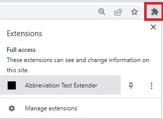

# Table of Contents
- [Abbreviation Text Extender](#abbreviation_text_extender)
    - [Installation](#installation)
    - [How to Use](#how_to_use)
    - [Navigating to the options page](#abbr_option_page)
    - [Importing abbreviations](#importing_abbreviations)
    - [Adding abbreviations](#adding_abbreviations)
    - [Searching abbreviations](#searching_abbreviations)
    - [Removing abbreviations](#removing_abbreviations)
    - [License](#license)

    
# Abbreviation Text Extender 

The Abbreviation Text Extender is a Chrome extension that allows users to expand text automatically by utilizing the Chrome Storage API to store user-defined abbreviations and replace them with the expanded text whenever the user types them into any text input or textarea field on a webpage. The extension was designed with the goal of reducing typing time for users who may have difficulty with fine motor skills, including those with physical disabilities.

The `extension` folder contains source code for the Chrome extension, as well as a README file that provides instructions on how to install and use the extension. 

## Installation 
1.  Clone this repository or download the source code as a ZIP file and extract it to your local machine.
2.  Open Google Chrome and navigate to `chrome://extensions`.
3.  Toggle on the "Developer mode" switch on the top right corner of the page.
4.  Click the "Load unpacked" button on the top left corner of the page.

5.  Select the extracted directory of the extension.

## How to Use 
1.  Open any webpage with a text input or textarea field.
2.  Type any user-defined abbreviation into the input field.
3.  The abbreviation should be replaced automatically with the correct spelling.

## Navigating to the options page 
1. Click on the Extension icon in the Chrome toolbar.

2. Click on the "Go To Options" button.

## Importing abbreviations 
1. Click on the Extension icon in the Chrome toolbar.
2. Click on the "Go To Options" button.
3. In the options page, click on the "Browse" button.
4. Select the file containing the abbreviations

## Adding abbreviations 

1.  Click on the Abbreviation Text Extender icon in the Chrome toolbar.
2.  Click on the "Go To Options" button.
3.  In the options page, type in the abbreviation in the "Replace" input field and the expanded text in the "With" input field.
4.  Click on the "Add or Update" button to add the abbreviation and expanded text to the list.

## Searching abbreviations 

1.  Click on the Abbreviation Text Extender icon in the Chrome toolbar.
2.  Click on the "Go To Options" button.
3.  In the options page, type in the abbreviation in the "Replace" input field
4.  The abbreviation and expanded text pair should show up in the list

## Clearing search filter 

1.  Click on the Abbreviation Text Extender icon in the Chrome toolbar.
2.  Click on the "Go To Options" button.
3.  In the options page, click on the "Clear Filter" button to clear the search/replace filter

## Removing abbreviations 

1.  Click on the Abbreviation Text Extender icon in the Chrome toolbar.
2.  Click on the "Go To Options" button.
3.  Find the abbreviation and expanded text that you want to remove in the list.
4.  Click on the "Delete" button to remove the abbreviation and correction from the list.

## License 

These codes are released under the MIT License. Feel free to use, modify, and distribute them as needed.
