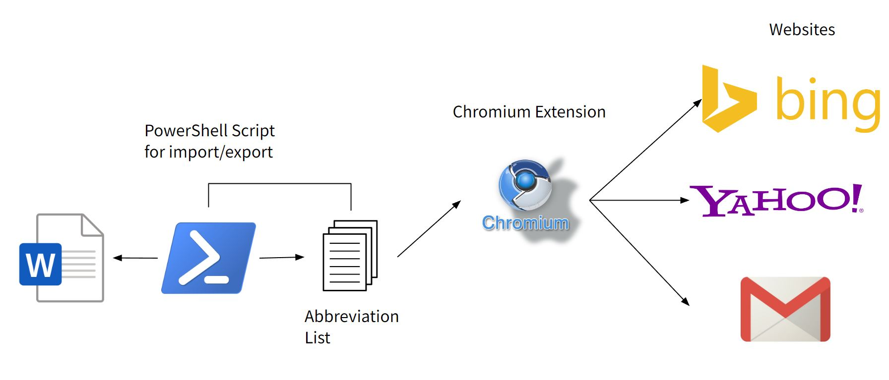

### Table of Contents

- [Introduction](#introduction)
- [Problem](#problem)
- [Related Work](#related_work)
- [Methodology](#methodology)
- [Disability Justice Perspective](#disability_justice_perspective)
    - [Collective access](#collective_access)
    - [Leadership of those most impacted](#leadership_of_those_most_impacted)
    - [Anti-capitalist politic](#anti_capitalist_politic)
- [Learnings and Future Work](#learnings_and_future_work)
- [Accessibility](#accessibility)
- [Source Code](#source_code_and_user_guide)
    - [Abbreviation Text Extender](#abbreviation_text_extender)
    - [Microsoft Word AutoCorrect Abbreviation Import/Export Scripts](#ms_script)
    - [License](#license)

### Introduction 

The Abbreviation Text Extender is a Chrome extension that aims to improve typing efficiency for people with disabilities. The extension enables users to create a list of abbreviations that automatically expand into the full text when typed into any text input field on a webpage. This feature can be particularly beneficial for individuals with limited mobility or dexterity, who may find it challenging to type quickly and accurately.

### Problem 

The Abbreviation Text Extender was designed to address the challenges faced by people with disabilities, especially those with motor impairments, who may struggle with spelling and typing accuracy, resulting in slower communication. This tool allows users to create custom abbreviations that automatically expand into full text, reducing typing time and increasing accuracy.

Following discussions with the client, the main requirement for the project is to develop an abbreviation expansion tool that can be used outside of Microsoft Word. The client expressed frustration with the limitations of Microsoft Word's abbreviation expansion feature, which only works within the program. The client also requested that the tool should have limited scrolling with large enough text to select by mouse.

To meet these requirements, a chromium extension was proposed as the solution, which enable user to load the abbreviation directory into the browser and expand abbreviations as type. The client will also receive instructions on how to export their existing abbreviation directory from Microsoft Word.

Finally, the client also asked if it is possible to reverse engineer the extracted text file and add new entries to the Office AutoCorrect file, as adding new entries in Office can be difficult due to the small text size.

### Related Work 

There are several other tools available that offer similar functionality to the Abbreviation Text Extender and Microsoft Word AutoCorrect Abbreviation Import/Export Scripts, including text expansion software and third-party AutoCorrect managers for Microsoft Word. However, many of these tools are limited in their capabilities or require significant setup time. The Abbreviation Text Extender and Microsoft Word AutoCorrect Abbreviation Import/Export Scripts were developed with the goal of providing a lightweight, easy-to-use option for users who need a simple and effective way to manage their abbreviations in both Microsoft Word and improve their typing efficiency in a browser.

- [PhraseExpress](https://www.phraseexpress.com/): A text expansion tool that allows users to create macros for frequently used phrases or text snippets. It supports customizable hotkeys and has features such as autocomplete and suggestions.

- [AutoHotkey](https://www.autohotkey.com/): A free, open-source tool for Windows that allows users to automate repetitive tasks, including text expansion. It includes a scripting language and supports hotkeys, macros, and remapping of keys.

- [Breevy](http://www.16software.com/breevy/): A Windows text expander that allows users to create abbreviations for commonly used words, phrases, or text snippets. It supports keyboard shortcuts and includes a built-in spell checker.

### Methodology 

The Microsoft Word AutoCorrect Abbreviation Import/Export Scripts provide a solution for managing AutoCorrect abbreviations in Microsoft Word. These scripts allow users to export their current AutoCorrect abbreviations to a text file, modify them as needed, and then import the updated abbreviations back into Microsoft Word.

For the Abbreviation Text Extender, users can import abbreviations exported by the Import/Export script and customize their own list of abbreviations within the extension's options page. The user-defined abbreviations are stored using the Chrome Storage API, accessible across different signed-in browsers, and are automatically expanded whenever the user types them into any text input or textarea field on a webpage.

To import a list of abbreviations into the Abbreviation Text Extender, users can simply export their abbreviations from Microsoft Word and import them into the extension's options page. This streamlines the process of transferring existing abbreviations and incorporating them into the extension.

### Disability Justice Perspective 

A disability studies perspective was fundamental in informing the design and implementation of the Abbreviation Text Extender. The extension was developed with the goal of promoting accessibility and inclusivity, empowering individuals with disabilities to overcome challenges related to typing and communication. By incorporating the perspectives and experiences of people with disabilities, the Abbreviation Text Extender represents a step forward in disability justice.

#### Collective access 

Text expansion extension can promote collective access by providing a customizable tool that allowing for a more inclusive and accessible communication environment. The Chrome extension is accessible by VoiceOver and keyboard navigation to meet the needs of a wider range of disabled individuals.

#### Leadership of those most impacted  

The development and use of text expansion extension should center the voices and experiences of disabled individuals who are most impacted by barriers to communication and participation. I have worked with the disabled academic very closely to identify the need and gather feedback throughout the whole development.

#### Anti-capitalist politic  

The extension is open source and free to download from GitHub, it challenges the capitalist notion that all products and services must be commodified and monetized for profit. By making extension available for free, we can prioritize the needs of disabled individuals over the interests of corporations and software companies, who often charge exorbitant prices for assistive technology and other disability-related products.

### Learnings and Future Work   

To further improve the accessibility of the Abbreviation Text Extender, I learned in the importance of creating a simple, intuitive design is crucial for accessibility. Moving forward, I plan to expand the functionality of the extension to include customization options, such as the ability to assign keyboard shortcuts to abbreviations. We also aim to support text expansion in various editors, including Google Docs and Microsoft Word Online, and other canvas-based rendering editors.

### Accessibility  

The Abbreviation Text Extender was designed with accessibility in mind. The extension includes keyboard accessibility features and conforms to W3C Level A accessibility standards. We also conducted user testing with individuals with disabilities, including testing with Microsoft Narrator, to ensure that the extension is user-friendly and easy to navigate.

### Source Code and User Guide  

The source code for both the Abbreviation Text Extender and the Microsoft Word AutoCorrect Abbreviation Import/Export Scripts is available on GitHub:

#### Abbreviation Text Extender  
- The [Abbreviation Text Extender](https://github.com/makkamchuen/Abbreviation-Text-Extender/tree/main/extension) is a Chrome extension that allows users to expand text automatically by utilizing the Chrome Storage API to store user-defined abbreviations and replace them with the expanded text whenever the user types them into any text input or textarea field on a webpage. The extension was designed with the goal of reducing typing time for users who may have difficulty with fine motor skills, including those with physical disabilities. The `extension` folder contains source code as well as a [README](https://github.com/makkamchuen/Abbreviation-Text-Extender/tree/main/extension) file that provides instructions on how to install and use the extension. 

#### Microsoft Word AutoCorrect Abbreviation Import/Export Scripts  
- The [Microsoft Word AutoCorrect Abbreviation Import/Export Scripts](https://github.com/makkamchuen/Abbreviation-Text-Extender/tree/main/utilities) contains two PowerShell scripts for importing and exporting Microsoft Word AutoCorrect abbreviations to/from a text file, as well as two batch scripts for executing the PowerShell scripts in a Windows environment. The scripts were developed with the goal of helping users manage their AutoCorrect abbreviations in Microsoft Word more efficiently. The `utilities` folder contains source code as well as a [README](https://github.com/makkamchuen/Abbreviation-Text-Extender/tree/main/utilities) file that provides instructions on how to install and use the extension. 

#### License 
These codes are released under the MIT License. Feel free to use, modify, and distribute them as needed.